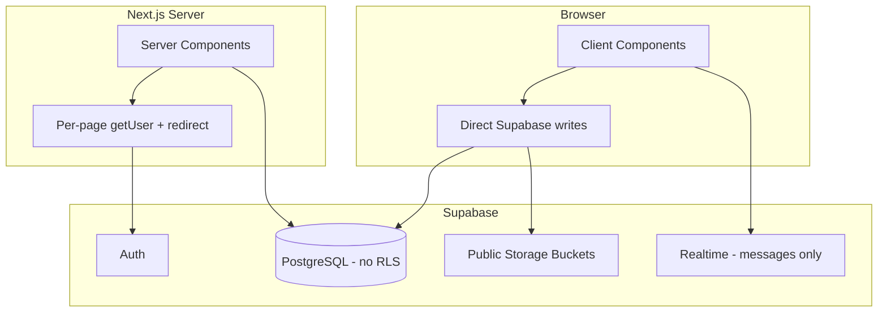

# StudentSpace Production Readiness Analysis

## Executive Summary

StudentSpace is a **feature-rich V1** that works end-to-end for real tutoring workflows. The build passes, core domains (classes, homework, schedule, materials, chat, analytics, parent linking, employer overview) are implemented, and the product has clearly moved beyond the original "per-student space" design in `CLAUDE.md` to a **class-centric model** documented in `ReduMe.md`.

What makes it "hacked together" is not missing features — it's **missing production infrastructure**: no database in version control, no RLS, no centralized auth, no API/server-action layer, no tests, no CI, permissive storage, and business rules enforced only in UI. Anyone with the anon key and basic Supabase knowledge can bypass restrictions.

The path to production is **layered hardening**, not a rewrite. Each layer builds on the previous one.

---

## 1. What the Codebase Is Today

### Architecture



| Layer | Technology | Pattern |
|-------|-----------|---------|
| Framework | Next.js 16.2.4, React 19, TypeScript | App Router, ~25 routes |
| Styling | Tailwind v4 + CSS variables (`globals.css`) | Inline styles dominate; shadcn installed but barely used |
| Backend | Supabase (PostgREST + Auth + Storage + Realtime) | **No API routes, no Server Actions, no middleware** |
| Auth | Supabase email/password | Per-page `getUser()` → `redirect("/login")` |
| Data model | Class-centric (`classes`, `class_members`, `invites`) | **Not** the old `students`/`registration_requests` model in `CLAUDE.md` |
| Docs | `ReduMe.md` = live spec; `CLAUDE.md` = outdated | Schema lives only in Supabase dashboard |

### Route Inventory (25 pages)

| Area | Routes | Status |
|------|--------|--------|
| Public | `/`, `/login`, `/signup` | Working |
| Dashboard | `/dashboard`, `/dashboard/analytics`, `/inbox` | Working |
| Settings | `/settings/access`, `/settings/preferences` | Access ✅ / Preferences stub |
| Classes | `/classes/new`, `/classes/[id]/*` (7 sub-routes) | Working |
| Employer | `/employer`, `/employer/inbox`, person detail pages | Overview ✅ / analytics & settings stubs |

### Data Access Pattern

Every feature follows the same pattern:

1. **Server page** fetches data via `createClient()` from `utils/supabase/server.ts`
2. **Client component** (`*Client.tsx`) handles mutations via browser `createClient()`
3. **`router.refresh()`** after writes to re-fetch server data

There is no shared authorization module, no mutation layer, and no transaction safety for multi-step operations (e.g. payment cycle close + overflow lesson insert).

---

## 2. Feature Classification

### ✅ Implemented and Functional

| Domain | What Works |
|--------|-----------|
| **Auth** | Signup (personal/business), login, logout, employer redirect via `is_employer` |
| **Classes** | Create, edit, soft-delete, member management, leave class |
| **Invites** | Email search → invite → inbox accept/decline → `class_members` |
| **Homework** | Tutor CRUD, attachments (drag-drop), student submit, tutor feedback page |
| **Schedule** | Weekly calendar, schedule/makeup/complete/miss, payment cycle auto-close + overflow |
| **Materials** | Groups, upload, pin, edit, soft-delete |
| **Chat** | Realtime via `postgres_changes`, role-colored messages |
| **Payment cycles** | Auto-create on class creation, hours accumulate, overflow rollover |
| **Parent linking** | Email search, request/accept flow, analytics scoping |
| **Analytics** | Tutor/student/parent tabs, time ranges, earnings with fixed FX rates |
| **Overview** | Rich per-class dashboard for tutor and student |
| **Employer portal** | Separate layout, tutor/student grid, person detail, inbox |

### 🟡 Partially Implemented (works but incomplete or fragile)

| Item | Gap |
|------|-----|
| **Authorization** | UI hides tutor actions; **not enforced** at DB or server mutation layer |
| **Homework deadlines** | UI locks submissions; **client can still insert** via Supabase directly |
| **Resubmissions** | DB allows multiples; UI blocks after first submit |
| **Invite page** | No tutor-role guard — any class member can invite if they know the URL |
| **Chat page** | Client-only auth check; relies on parent layout for route protection |
| **Storage** | Public buckets with permissive policies — files are URL-guessable |
| **User search** | Invite/access flows expose whether an email exists (enumeration) |
| **Payment cycle logic** | Lives in `ScheduleClient.tsx` — race conditions possible on concurrent completes |
| **Lesson `cancelled` status** | In schema docs, no UI action |
| **`paid_at` marking** | Column exists, read in analytics, **no UI to mark paid** |
| **Language toggle** | EN/GE switch in dashboard — **no translations** |
| **shadcn/ui** | Installed; app uses raw `<input>`/`<button>` with inline styles |
| **Type safety** | ~90 `any` usages across 16 files |
| **Metadata** | Still says "Create Next App" in `app/layout.tsx` |
| **Dead code** | `app/logout-button.tsx` unused |

### ❌ Missing Entirely

| Item | Notes |
|------|-------|
| **RLS policies** | Explicitly deferred in `ReduMe.md` — biggest security gap |
| **SQL migrations in repo** | Schema managed only in Supabase dashboard |
| **Middleware** | No `middleware.ts` — auth duplicated on ~20 pages |
| **API layer / Server Actions** | All mutations from browser |
| **Tests** | Zero unit, integration, or E2E tests |
| **CI/CD pipeline** | No `.github/workflows`, no pre-deploy checks |
| **Error boundaries** | No `error.tsx`, `loading.tsx`, or `not-found.tsx` |
| **Email verification** | Users can sign up and log in immediately |
| **Tutor-approved registration** | Old spec flow abandoned; open signup instead |
| **Employer analytics** | Placeholder page |
| **Employer settings / org hierarchy** | Placeholder + V2 roadmap |
| **User preferences** | Placeholder page |
| **Georgian i18n** | Toggle only, no string catalog |
| **Monitoring/logging** | No Sentry, no structured logging |
| **Rate limiting** | None on auth or uploads |
| **Backup/restore docs** | No operational runbook |

### 🔧 Needs Modification (not missing, but wrong for production)

| Area | Problem | Direction |
|------|---------|-----------|
| **Security model** | App-layer-only RBAC | RLS + server-side mutation guards |
| **File storage** | Public URLs for homework/submissions | Private buckets + signed URLs |
| **Client mutations** | Business logic in `*Client.tsx` | Server Actions or API routes with role checks |
| **Auth guards** | Copy-pasted per page | Middleware + shared `requireAuth()` / `requireClassMember()` |
| **Payment cycle close** | Multi-step client inserts | DB function or server action in a transaction |
| **Documentation** | `CLAUDE.md` contradicts live app | Consolidate to one source of truth |
| **Supabase types** | Hand-written interfaces | Generate from schema (`supabase gen types`) |
| **Inline styles** | Hundreds of `style={{}}` blocks | Migrate to design system (Tailwind classes or shadcn) |

---

## 3. Layered Production Roadmap

Each layer is a **gate**: don't start layer N+1 until layer N is solid enough that you're not rebuilding on sand.

---

### Layer 0 — Baseline & Inventory (~1 week)

**Goal:** Know exactly what you're running in production.

| Task | Why |
|------|-----|
| Export full Supabase schema to `supabase/migrations/` | Schema becomes version-controlled and reviewable |
| Run `supabase gen types typescript` → `lib/database.types.ts` | End hand-written `any` interfaces |
| Reconcile docs: update `CLAUDE.md` or retire it; make `ReduMe.md` authoritative | Stop confusion for future you and AI assistants |
| Document env vars, Supabase project ID, bucket names in README | Onboarding and disaster recovery |
| Fix metadata (`title`, `description`, `lang`) | Basic production hygiene |
| Remove dead code (`logout-button.tsx`) | Reduce noise |

**Exit criteria:** Schema in git, generated types in use, docs match reality.

---

### Layer 1 — Security Foundation (~2–3 weeks)

**Goal:** A malicious or curious user with the anon key cannot read/write data they shouldn't.

This is the **highest-priority layer**. Everything else is cosmetic until this is done.

#### 1a. Auth Middleware

```
middleware.ts
  → refresh session
  → protect /dashboard, /classes, /inbox, /settings, /employer
  → redirect employers away from /dashboard (and vice versa)
```

Replace duplicated `getUser()` + `redirect()` on every page with one middleware + thin shared helpers (`lib/auth.ts`).

#### 1b. Row Level Security (table by table)

Enable RLS on all tables. Minimum policies:

| Table | Policy Logic |
|-------|-------------|
| `users` | Read own row; read others only if shared class member |
| `classes` | Read if member; write if tutor member or creator |
| `class_members` | Read if member of same class; insert via invite acceptance or tutor |
| `homework` | Read if class member; write if tutor |
| `submissions` | Read if class member; insert if student + before deadline; update grade if tutor |
| `lessons` | Read if member; write if tutor |
| `messages` | Read/insert if member |
| `materials` / `material_groups` | Read if member; write if tutor |
| `payment_cycles` | Read if member; write if tutor |
| `invites` | Read if inviter or invitee; write if tutor |
| `parent_students` / `parent_requests` | Scoped to involved parties |

Write policies as SQL migrations, test each with different role JWTs.

#### 1c. Storage Hardening

- Make buckets **private**
- RLS policies on `storage.objects`: upload only if class member with correct role; read via signed URLs
- Replace `getPublicUrl()` with `createSignedUrl()` (server-side)

#### 1d. Close Known Auth Holes

- Invite page: server-side tutor check before render
- Chat: move initial load to server component or add explicit membership guard
- User email search: consider restricting to "invite flow only" with rate limiting

**Exit criteria:** RLS enabled on all tables; storage private; middleware protects routes; manual pen-test with anon key fails for unauthorized operations.

---

### Layer 2 — Server-Side Business Rules (~2 weeks)

**Goal:** Critical rules enforced where they can't be bypassed.

Move mutations from client components to **Server Actions** (or Route Handlers) with explicit role checks:

| Action | Rules to Enforce Server-Side |
|--------|------------------------------|
| `submitHomework` | Student role, deadline not passed, class membership |
| `completeLesson` | Tutor role, payment cycle logic in transaction |
| `createHomework` | Tutor role |
| `sendInvite` | Tutor role |
| `postMessage` | Class membership |
| `uploadMaterial` | Tutor role |
| `acceptInvite` | Invitee only, pending status |

**Payment cycle close** should become a Postgres function:

```sql
-- Pseudocode: complete_lesson(lesson_id)
-- 1. Mark lesson completed
-- 2. Sum hours in active cycle
-- 3. If overflow: close cycle, open next, insert carry-over lesson
-- All in one transaction
```

This eliminates race conditions from `ScheduleClient.tsx`.

**Exit criteria:** No direct `.insert()`/`.update()` from client for protected operations; business rules tested against RLS + server actions.

---

### Layer 3 — Code Quality & Architecture (~2–3 weeks)

**Goal:** Maintainable codebase a second developer (or future you) can work in.

| Task | Detail |
|------|--------|
| **Shared lib modules** | `lib/auth.ts`, `lib/classes.ts`, `lib/homework.ts` — queries and guards in one place |
| **Eliminate `any`** | Use generated Supabase types; strict mode already on |
| **Component extraction** | `FileDropZone`, `DeadlineBadge`, modals → `components/` |
| **Design system adoption** | Gradually replace inline styles with Tailwind + shadcn components |
| **Error/loading states** | Add `error.tsx`, `loading.tsx` per route group |
| **Form validation** | Add Zod schemas for all forms (signup, class create, homework post) |
| **Consistent patterns** | Server page fetches → passes to client; client calls server actions only |

**Exit criteria:** No new `any` types; shared auth helpers used everywhere; forms validated with Zod.

---

### Layer 4 — Testing & CI (~2 weeks)

**Goal:** Regressions caught before deploy.

#### Test Pyramid

| Level | What | Tool |
|-------|------|------|
| **Unit** | Payment cycle math, deadline logic, role helpers | Vitest |
| **Integration** | RLS policies with test users | Supabase local + Vitest |
| **E2E** | Login → create class → post homework → submit | Playwright |
| **Smoke** | Build + lint on every PR | GitHub Actions |

#### CI Pipeline (`.github/workflows/ci.yml`)

```
on: push, pull_request
  → npm ci
  → npm run lint
  → npm run build
  → npm test (when added)
  → (optional) Playwright against preview deploy
```

**Exit criteria:** CI green on main; at least E2E happy path covered; RLS policy tests for each role.

---

### Layer 5 — Reliability & Observability (~1 week)

**Goal:** Know when things break in production.

| Task | Tool |
|------|------|
| Error tracking | Sentry (Next.js integration) |
| Structured logging | Server action errors logged with context |
| Uptime monitoring | Better Uptime or Vercel Analytics |
| Supabase backups | Verify point-in-time recovery is enabled (Pro tier) or manual backup script |
| Rate limiting | Supabase Auth built-in + optional Upstash for API routes |

Add `error.tsx` at root and per route group with user-friendly fallback UI.

**Exit criteria:** Errors surface in Sentry; you get alerted on downtime; backup strategy documented.

---

### Layer 6 — Feature Completion & Polish (~2–3 weeks)

**Goal:** Close stubs and V2 items that matter for real-world use.

Prioritized by user impact:

| Priority | Feature | Effort |
|----------|---------|--------|
| P0 | Mark payment cycle as paid (`paid_at` UI) | Small |
| P0 | Email verification (Supabase Auth setting + confirm page) | Medium |
| P1 | Lesson `cancelled` status in schedule UI | Small |
| P1 | Homework resubmit before deadline | Small |
| P1 | Employer analytics (reuse main analytics with employer scoping) | Medium |
| P2 | User preferences (timezone, display name) | Medium |
| P2 | Georgian translations (i18n with `next-intl` or similar) | Large |
| P2 | Live currency exchange rates | Small |
| P3 | Employer org hierarchy | Large (V2) |
| P3 | Push notifications | Large (V2) |

**Exit criteria:** No "Coming soon" pages for features you need day-to-day; email verification on.

---

### Layer 7 — Operational Readiness (~1 week)

**Goal:** Confident deploys and recovery.

| Task | Detail |
|------|--------|
| **Deployment checklist** | Env vars on Vercel, Supabase URL whitelist, Auth redirect URLs |
| **Staging environment** | Separate Supabase project or branch DB for testing migrations |
| **Migration workflow** | `supabase db push` or `supabase migration up` as part of deploy |
| **Runbook** | How to restore DB, rotate keys, handle auth issues |
| **Domain & SSL** | Custom domain on Vercel if not already |
| **Security headers** | `next.config.ts` — CSP, HSTS, X-Frame-Options |

**Exit criteria:** You can deploy a migration to staging, run E2E, promote to prod, and recover from a bad deploy.

---

## 4. Visual Roadmap Timeline

```
Week:  1    2    3    4    5    6    7    8    9   10   11   12
       ├────┤
       L0 Baseline
            ├──────────┤
            L1 Security (RLS + middleware + storage)
                       ├────────┤
                       L2 Server-side rules
                                ├──────────┤
                                L3 Code quality
                                           ├────┤
                                           L4 Testing & CI
                                                ├─┤
                                                L5 Observability
                                                   ├──────────┤
                                                   L6 Features & polish
                                                              ├─┤
                                                              L7 Ops readiness
```

**Minimum viable production** = Layers 0 + 1 + 2 + 4 (smoke) + 5 + 7 ≈ **8–10 weeks** at a steady pace.

**Full production grade** = all layers ≈ **12–14 weeks**.

---

## 5. Risk Register

| Risk | Severity | Mitigation Layer |
|------|----------|-----------------|
| Anyone with anon key reads all data | **Critical** | L1 RLS |
| Student submits homework after deadline via API | **High** | L1 RLS + L2 server action |
| Public file URLs leak homework/submissions | **High** | L1 storage hardening |
| Payment cycle double-close on concurrent completes | **Medium** | L2 DB function |
| Schema drift between dashboard and code | **Medium** | L0 migrations in git |
| No way to know prod is broken | **Medium** | L5 Sentry |
| Employer/parent sees wrong data after bug | **Medium** | L4 RLS tests |

---

## 6. What NOT to Do

- **Don't rewrite** — the feature set works; harden in place.
- **Don't adopt a new stack** — Supabase + Next.js is fine for 1–10 students.
- **Don't polish UI before security** — pretty pages with open RLS is still broken.
- **Don't build employer org hierarchy before RLS** — scope creep on insecure foundation.
- **Don't add tests before RLS** — you'd be testing a system you're about to change fundamentally.

---

## 7. Recommended First Sprint (Layer 0 + Start Layer 1)

If you want one concrete starting point:

1. **Export schema** from Supabase → `supabase/migrations/0001_initial.sql`
2. **Generate TypeScript types** from that schema
3. **Add `middleware.ts`** protecting authenticated routes
4. **Enable RLS on `messages` and `homework`** as a pilot — write policies, test with each role
5. **Fix invite page** tutor guard (quick win, demonstrates the pattern)

That sprint gives you version-controlled schema, typed queries, centralized auth routing, and proof that RLS works — without touching every table at once.

---

## 8. Doc Drift Note

The project has three conflicting narratives:

| Document | Says |
|----------|------|
| `CLAUDE.md` | Per-student spaces, `registration_requests`, tutor approval, Phase 6 "homework first" |
| `ReduMe.md` | Class-centric model, open signup, V1 feature-complete |
| Live code | Matches `ReduMe.md`; build is Next.js 16, not 15 |

**Recommendation:** Retire or rewrite `CLAUDE.md` to match `ReduMe.md`. The class-centric model is the right one for this scale.

---

*Generated from codebase analysis. See `PRODUCTION-TASKS-BY-DIFFICULTY.md` for items sorted by effort.*
